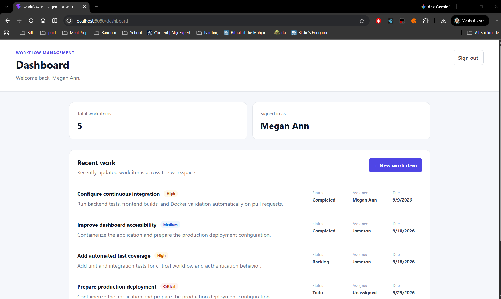
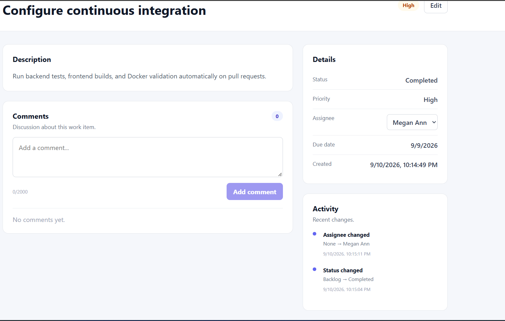
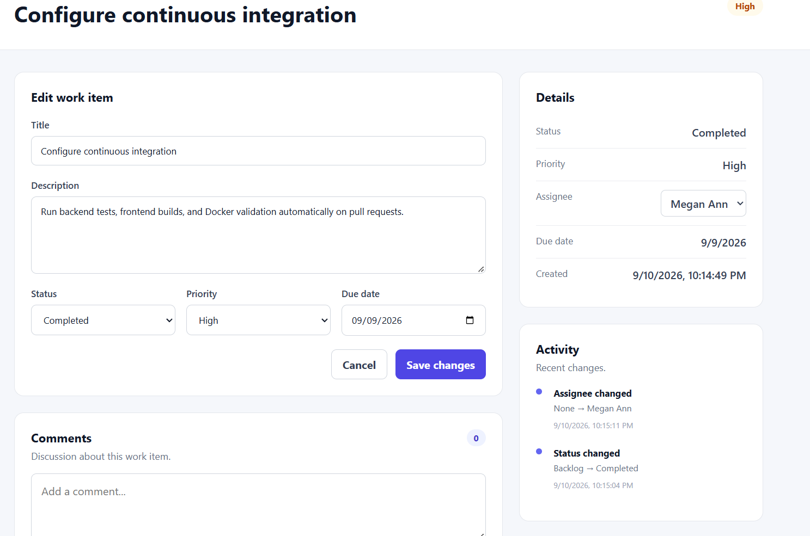
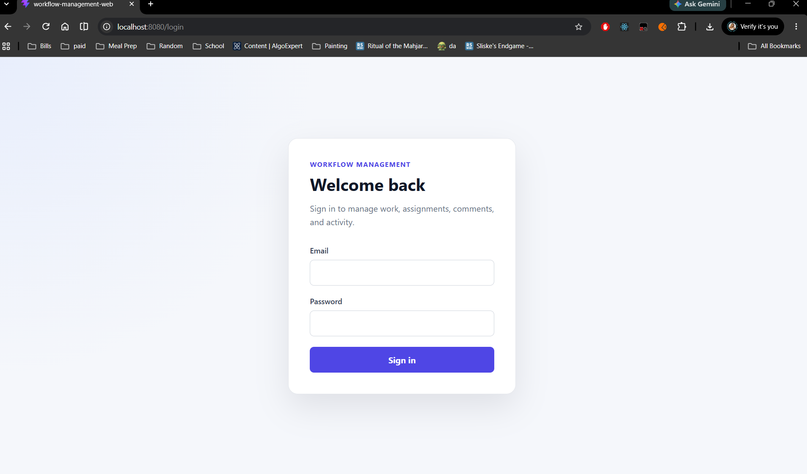
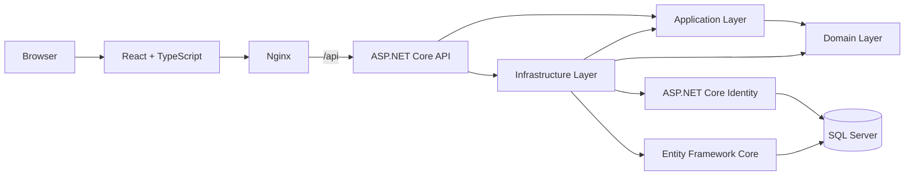

# Workflow Management Platform

[](https://github.com/lovelyAphorist/WorkflowManagement/actions/workflows/ci.yml)


A full-stack workflow management application built with **ASP.NET Core, React, TypeScript, Entity Framework Core, SQL Server, ASP.NET Identity, and Docker**.

I built this project as a production-style portfolio application to demonstrate more than basic CRUD: layered architecture, authentication and authorization, audit logging, server-side querying, automated testing, CI, and containerized deployment.



## Highlights

- Secure registration and login with **ASP.NET Core Identity** and **JWT bearer authentication**
- **Admin / Member role-based authorization** with protected API endpoints
- Full work-item lifecycle management with title, description, status, priority, due date, and assignment
- Admin-only work-item assignment with user-friendly assignee data in API responses
- Field-level **audit history** for title, description, status, priority, due date, and assignee changes
- Work-item comments with authenticated authorship and ownership-aware edit/delete rules
- Server-side **search, filtering, sorting, and pagination** using EF Core query composition
- React protected routes and persisted session authentication
- Unit and integration tests with **xUnit, Moq, WebApplicationFactory, and SQLite in-memory testing**
- GitHub Actions CI for backend build/tests, frontend production build, and Docker validation
- Docker Compose environment with **React/Nginx + ASP.NET Core API + SQL Server**

## Application Features

### Work items

Work items can be created, viewed, edited, deleted, assigned, and tracked through their lifecycle. New items begin in `Backlog` and support the following statuses:

`Backlog` · `Todo` · `InProgress` · `Blocked` · `Completed` · `Cancelled`

Priorities are represented as:

`Low` · `Medium` · `High` · `Critical`

The list endpoint performs filtering and pagination in SQL rather than loading all records into memory. Supported query options include search text, status, priority, page, page size, sort field, and sort direction.

### Authentication and authorization

The application uses ASP.NET Core Identity for user management and password hashing, while JWT bearer tokens authenticate API requests.

Two application roles are supported:

| Capability | Member | Admin |
| --- | :---: | :---: |
| View work items | ✓ | ✓ |
| Create and update work items | ✓ | ✓ |
| Add comments | ✓ | ✓ |
| Edit own comments | ✓ | ✓ |
| Delete own comments | ✓ | ✓ |
| View user directory |  | ✓ |
| Assign work items |  | ✓ |
| Delete work items |  | ✓ |
| Moderate another user's comment |  | ✓ |

The frontend uses role information from the authenticated session to adjust the UI, while the API independently enforces permissions with authorization policies/attributes. UI checks are never treated as the security boundary.

### Audit history

Updates automatically create field-level history records containing the old value, new value, change type, and UTC timestamp. Work-item changes and their corresponding history entries are persisted together so the audit trail stays consistent with the work-item state.

Examples:

```text
Status      Backlog    → InProgress
Priority    Medium     → High
Assignee    Unassigned → Megan Ann
Due date    2026-09-18 → 2026-09-25
```

No-op updates do not create fake history records or unnecessarily update the `UpdatedAtUtc` timestamp.

### Comments

Authenticated users can participate in work-item discussions. The server determines the comment author from JWT claims instead of accepting an arbitrary author ID from the browser.

- Users can edit their own comments.
- Users can delete their own comments.
- Admins can delete comments for moderation.
- Admins cannot rewrite another user's comment.

## Screenshots

### Work item details

The detail view combines assignment, due date, comments, and audit history in one screen.



### Editing a work item

Changes made through the React UI are persisted through the API and automatically appear in the activity history.



### Login



## Architecture



The backend follows a layered dependency structure:

```text
WorkflowManagement.Api
        │
        ├──────────────► WorkflowManagement.Application
        │                         │
        │                         ▼
        │                WorkflowManagement.Domain
        │
        └──────────────► WorkflowManagement.Infrastructure
                                  │
                                  ├────► Application
                                  └────► Domain
```

- **Domain** contains core entities and enums without infrastructure dependencies.
- **Application** contains DTOs, service contracts, repository contracts, and business logic.
- **Infrastructure** implements persistence, Identity, JWT generation, and EF Core configuration.
- **API** handles HTTP concerns, dependency injection, authentication middleware, authorization, and OpenAPI.
- **React frontend** consumes the API through typed client modules and protected routes.

## Technology Stack

| Area | Technology |
| --- | --- |
| Backend | C# / .NET 10 / ASP.NET Core Web API |
| Frontend | React 19 / TypeScript / Vite |
| Routing | React Router |
| Database | SQL Server |
| ORM | Entity Framework Core 10 |
| Authentication | ASP.NET Core Identity + JWT Bearer |
| API docs | Swagger / OpenAPI |
| Unit testing | xUnit + Moq |
| Integration testing | xUnit + WebApplicationFactory + SQLite in-memory |
| Web server / proxy | Nginx |
| Containers | Docker + Docker Compose |
| CI | GitHub Actions |

## Project Structure

```text
WorkflowManagement/
├── .github/
│   └── workflows/
│       └── ci.yml
├── docs/
│   └── images/
├── WorkflowManagement.Api/
├── WorkflowManagement.Application/
├── WorkflowManagement.Domain/
├── WorkflowManagement.Infrastructure/
├── WorkflowManagement.UnitTests/
├── WorkflowManagement.IntegrationTests/
├── workflow-management-web/
├── docker-compose.yml
└── WorkflowManagement.sln
```

## API Overview

### Authentication

| Method | Endpoint | Purpose |
| --- | --- | --- |
| `POST` | `/api/auth/register` | Register a user |
| `POST` | `/api/auth/login` | Authenticate and receive a JWT |

### Users

| Method | Endpoint | Purpose |
| --- | --- | --- |
| `GET` | `/api/users` | List users (Admin) |
| `GET` | `/api/users/{id}` | Get user details (Admin) |

### Work items

| Method | Endpoint | Purpose |
| --- | --- | --- |
| `GET` | `/api/work-items` | Search/filter/sort/page work items |
| `GET` | `/api/work-items/{id}` | Get one work item |
| `POST` | `/api/work-items` | Create a work item |
| `PUT` | `/api/work-items/{id}` | Update a work item |
| `DELETE` | `/api/work-items/{id}` | Delete a work item (Admin) |
| `PUT` | `/api/work-items/{id}/assignee` | Assign or unassign a work item (Admin) |
| `GET` | `/api/work-items/{id}/history` | View audit history |

### Comments

| Method | Endpoint | Purpose |
| --- | --- | --- |
| `GET` | `/api/work-items/{id}/comments` | List comments |
| `POST` | `/api/work-items/{id}/comments` | Add a comment |
| `PUT` | `/api/work-items/{id}/comments/{commentId}` | Edit own comment |
| `DELETE` | `/api/work-items/{id}/comments/{commentId}` | Delete own comment or moderate as Admin |

## Testing

The solution currently includes **5 unit tests and 2 integration tests**.

Unit tests focus on service-level business behavior, including:

- Work-item creation defaults and mapping
- Delete behavior for existing and missing items
- Audit-history creation when priority changes
- Avoiding database writes and fake audit entries when an update changes nothing

Integration tests run the real ASP.NET request pipeline with `WebApplicationFactory`. SQL Server is replaced with an isolated SQLite in-memory database so tests remain fast, deterministic, and suitable for CI.

Integration coverage includes:

- Protected work-item endpoints returning `401 Unauthorized` without a token
- Full registration → login → JWT issuance → authenticated protected request flow

Run all backend tests:

```bash
dotnet test
```

Build the frontend for production:

```bash
cd workflow-management-web
npm ci
npm run build
```

## Continuous Integration

GitHub Actions runs on pushes and pull requests with three independent jobs:

1. **Backend Build and Test** — restores, builds, and runs the .NET test suite.
2. **Frontend Build** — installs locked npm dependencies and runs the TypeScript/Vite production build.
3. **Docker Build** — validates the Compose configuration and builds the container images.

This verifies that the repository builds successfully outside the developer machine and that the application does not depend on local-only tooling or databases.

## Run with Docker

Docker is the simplest way to run the complete application.

### Prerequisites

- Docker Desktop with Linux containers / WSL 2
- Git

### 1. Clone the repository

```bash
git clone https://github.com/lovelyAphorist/WorkflowManagement.git
cd WorkflowManagement
```

### 2. Create local Docker configuration

Copy `.env.example` to `.env` and replace the placeholder values with your own strong development secrets.

```text
JWT_KEY=replace-with-a-long-random-key
SA_PASSWORD=replace-with-a-strong-sql-password
```

`.env` is intentionally ignored by Git. Real secrets should never be committed.

### 3. Start the stack

```bash
docker compose up --build
```

The Compose stack starts:

| Service | Address |
| --- | --- |
| React / Nginx | `http://localhost:8080` |
| ASP.NET Core API | `http://localhost:8081` |
| SQL Server | `localhost,14330` |

Nginx serves the React production build and proxies browser requests under `/api` to the ASP.NET Core container. SQL Server data is stored in a named Docker volume and survives normal container recreation.

To stop the stack without deleting data:

```bash
docker compose down
```

To intentionally delete the Docker database volume as well:

```bash
docker compose down -v
```

### 4. Register a local account

The current UI begins at the login screen. A local account can be registered through the public API before signing in.

Example with PowerShell:

```powershell
$body = @{
    displayName = "Demo User"
    email = "demo@example.com"
    password = "DemoUser123"
} | ConvertTo-Json

Invoke-RestMethod `
    -Uri "http://localhost:8080/api/auth/register" `
    -Method Post `
    -ContentType "application/json" `
    -Body $body
```

New registrations receive the `Member` role. The development Identity seeder creates the application roles and can be configured with a local demo account when testing Admin-only functionality.

## Local Development Without Docker

### Backend

Requirements:

- .NET 10 SDK
- SQL Server Express LocalDB
- Visual Studio 2026 or another compatible IDE

The default development connection string targets:

```text
(localdb)\MSSQLLocalDB
```

Configure JWT settings with .NET User Secrets from the repository root:

```powershell
dotnet user-secrets set "Jwt:Key" "replace-with-a-long-random-key" --project WorkflowManagement.Api
dotnet user-secrets set "Jwt:Issuer" "WorkflowManagement.Api" --project WorkflowManagement.Api
dotnet user-secrets set "Jwt:Audience" "WorkflowManagement.Web" --project WorkflowManagement.Api
dotnet user-secrets set "Jwt:ExpirationMinutes" "60" --project WorkflowManagement.Api
```

Apply EF Core migrations using Visual Studio's Package Manager Console with `WorkflowManagement.Infrastructure` selected as the default project:

```powershell
Update-Database
```

Run `WorkflowManagement.Api` using the HTTPS launch profile.

### Frontend

Requirements:

- Node.js 22+
- npm

Create `workflow-management-web/.env.local`:

```text
VITE_API_BASE_URL=https://localhost:7038
```

Install dependencies and start Vite:

```bash
cd workflow-management-web
npm install
npm run dev
```

The development frontend is configured to run on `http://localhost:60727`.

## Engineering Decisions

### DTOs instead of returning EF/Identity entities

API responses use dedicated DTOs rather than exposing persistence or Identity models. This keeps security-sensitive Identity fields out of the API contract and prevents the frontend from depending on database-specific entity shapes.

### Server-side query composition

Search, filtering, sorting, and pagination are applied to EF Core `IQueryable` expressions before execution. SQL Server performs the filtering and pagination instead of returning the entire table for in-memory processing.

### `DateOnly` for due dates

A work item's due date represents a calendar date rather than an instant in time, so the domain uses `DateOnly?` instead of storing artificial midnight timestamps.

### Audit writes alongside state changes

Work-item updates and their history entries are saved through the same EF Core unit of work. This prevents the business record from changing without its corresponding audit trail.

### Authorization belongs on the server

The React UI hides Admin-only controls for usability, but the ASP.NET Core API independently enforces permissions. Members cannot bypass the UI and call Admin-only operations directly.

### Batch user lookups

Paginated work-item and comment responses batch related user lookups rather than executing one user query per item, avoiding an N+1 query pattern.

### Docker reverse proxy

The production React bundle is served through Nginx. Browser requests use relative `/api` URLs, and Nginx forwards them to the API container. This keeps the browser on a single origin and avoids production CORS coupling between frontend and backend container addresses.

## Security Notes

- Passwords are hashed and managed by ASP.NET Core Identity.
- JWT signing secrets are supplied through User Secrets or environment variables, not committed configuration files.
- Docker secrets are read from an ignored `.env` file for local development.
- Role checks are enforced by ASP.NET Core authorization.
- Comment authorship is taken from authenticated claims rather than client-supplied user IDs.
- The React portfolio implementation currently persists the active JWT in `sessionStorage`; a production hardening path would move session credentials to secure HttpOnly cookies and add refresh-token/session management.

## Future Improvements

- Public cloud deployment and live demo URL
- Persisted/protected ASP.NET Data Protection keys in production containers
- Refresh-token or HttpOnly-cookie authentication flow
- Broader unit/integration test coverage
- Accessibility audit and automated UI testing
- Structured application logging and production observability

## Why I Built This

I wanted a portfolio project that reflects the kinds of concerns present in real application development rather than stopping at CRUD. The project intentionally includes authentication, authorization, auditability, relational data, validation, query performance, automated testing, CI, and containerized infrastructure while keeping the code organized into clear layers.

The result is a full-stack application that demonstrates both **C#/.NET backend engineering** and the ability to carry a feature through a **React/TypeScript frontend, database, automated tests, CI pipeline, and Docker runtime**.
